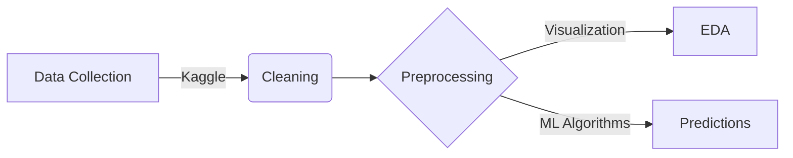
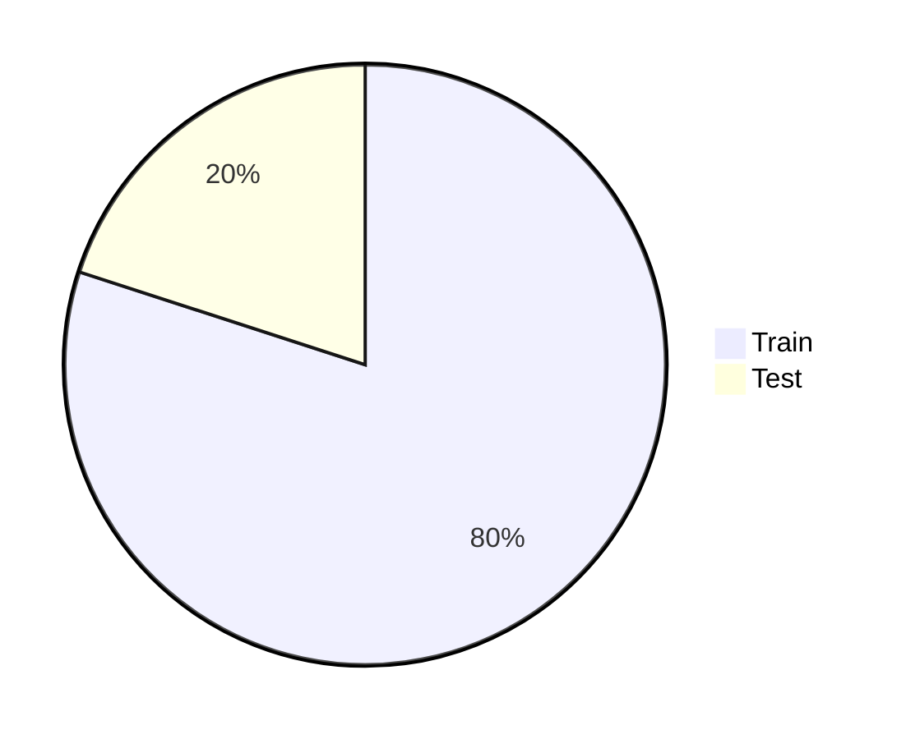

```mermaid
gantt
    title Heart Disease Classifications Model Accuracies
    dateFormat  X
    axisFormat %s

    section KNN
    0.81   : 0, 81
    section Rand'Forest
    0.83   : 0, 83
    section DecisionTree
    0.78   : 0, 78
```

# Heart Disease Prediction  

| Decsription                                  | Application/Web Link                                                                                          |
| ------------------------------------------- | --------------------------------------------------------------------------------------------------- |
| ${\textsf{\color{Darkblue}Predicting probability of heart disease in patients.}}$ |  |

***

***

<table align="center">
    <tr>
        <td width="10%">
            
        </td>
        <td>
            

                
                    <b>Diagnosing Heart Disease</b> 
                
            

        </td>
    </tr>
</table>

>  🎯 Aims to develop a predictive model for heart disease detection using a dataset containing various physiological and clinical attributes of individuals. 

>  🎯 The primary objective is to create a machine learning model that can accurately predict the likelihood of an individual having heart disease based on their characteristics and medical data.

___

<table align="center">
    <tr>
        <td width="7%">
            
        </td>
        <td>
            

                
                    <b>About Features</b> 
                
            

        </td>
    </tr>
</table>

|S.No|Features|Detail|
|------|------|------|
|1    | Age|   Refers to the numerical representation of a person's age in years.    |
|2    |Sex|   Typically represents the gender of an individual, often encoded as binary values (0 for female, 1 for male).   |
|3    |ChestPainType|   Categorization of chest pain experienced by individuals, often classified into categories like typical angina, atypical angina, non-anginal pain, and asymptomatic.|
|4    |RestingBP|Stands for Resting Blood Pressure and represents the blood pressure of an individual measured at rest in millimeters of mercury (mmHg).|
|5    | Cholesterol	|Denotes the level of cholesterol in the blood, usually measured in milligrams per deciliter (mg/dL). |
|6    |FastingBS|Stands for Fasting Blood Sugar and represents the blood sugar level of an individual after fasting, typically measured in milligrams per deciliter (mg/dL)  |
|7    |RestingECG|Resting Electrocardiographic Results, detailing the electrical activity of the heart at rest, often classified into different categories such as normal, abnormal ST-T wave, and hypertrophy.|
|8    |MaxHR| Maximum Heart Rate and represents the highest heart rate achieved by an individual during an exercise test, measured in beats per minute (bpm). |
|9    | ExerciseAngina |Exercise-Induced Angina, indicating whether an individual experiences chest pain during exercise, often represented as a binary value (0 for no, 1 for yes). |
|10     |	Oldpeak	|ST depression induced by exercise relative to rest, providing insights into the heart's activity during exercise.   |
|11   | ST_Slope |Refers to the slope of the peak exercise ST segment, which describes the heart rate change during exercise and recovery.  |
|12     |	HeartDisease    |Typically denotes the presence or absence of heart disease, often encoded as a binary value (0 for absence, 1 for presence) in the heart disease prediction dataset.    |

***
<table align="center">
    <tr>
        <td width="7%">
            
        </td>
        <td>
            

                
                    <b>Approach</b> 
                
            

        </td>
    </tr>
</table>

***
<table align="center">
    <tr>
        <td width="7%">
            
        </td>
        <td>
            

                
                    <b>Correlation between Features</b> 
                
            

        </td>
    </tr>
</table>

*** 
<table align="center">
    <tr>
        <td width="20%">
            
        </td>
        <td>
            

                
                    <b>Train Test Split</b> 
                
            

        </td>
    </tr>
</table>

***

<table align="center">
    <tr>
        <td width="8%">
            
        </td>
        <td>
            

                
                    <b>Classification Using Machine Learning Algorithms</b> 
                
            

        </td>
    </tr>
</table>

